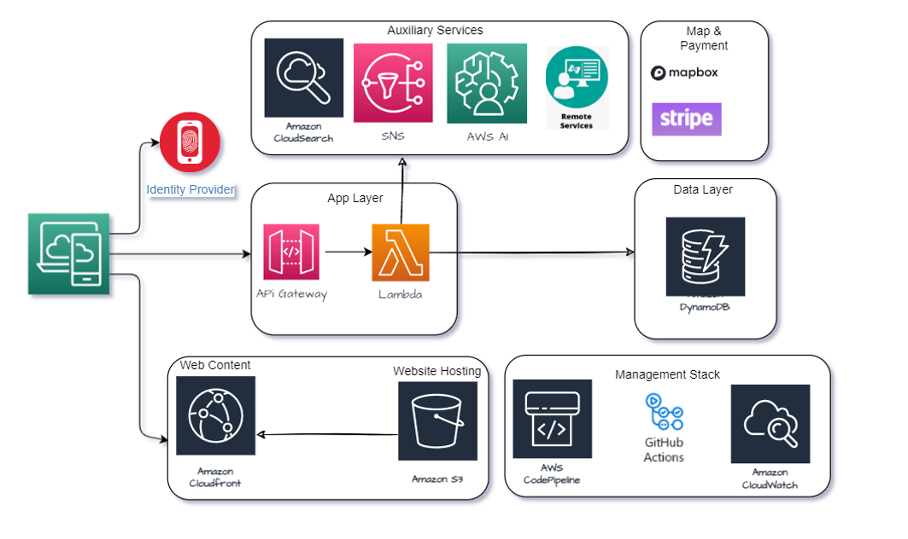

Whether you're a writing a small mobility App or a large scale enterprise product, we have something for you. Explore our architecture central to learn about the principles, patterns, practices, and tools that we follow to deliver you the solution that is simple, promotes reusability and flexibility.

                        Simple AWS Mobility/Web App

Following is an example architecture for quickly developing small App in AWS using available cloud native services.

                        Simple Azure Mobility/Web App

Following is an example architecture for quickly developing small App in AWS using available cloud native services.

                        Microservices based Enterprise Product

Following is an example architecture of a Microservices Based Enterprise Product that we follow:

                        Simple Event Driven Architecture Pattern

Following is an example of a Event Driven Architecture Pattern that we follow:
 

