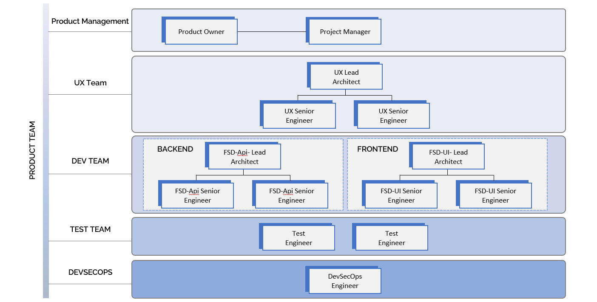

Welcome to PTR SAAS Platform:

Unlock Unlimited Potential with Fully Customizable Open SAAS Solutions

At PTR SAAS, we deliver fully open and customizable applications, empowering you to effortlessly add new features. Our platform is built to provide maximum flexibility, ensuring it meets your unique business requirements.

- Single Tenant App- Fully private, Fully Customizable
- Zero Tech debt- App with all artifacts
- Complete Open - You own it, you change it with no limit
- Highest flexibility - Any cloud / Any Changes
- One click E2E Engineering Team Available Ondemand to make changes
- Vendor Friendly -Deliver Apps to your own customers

                                What We Offer

#  Open and Customizable Single Tenant Applications

Experience unparalleled flexibility with our single-tenant SAAS applications,that is open and tailored to your unique business needs. Explore our robust backend platform and cutting-edge technology, delivering microservices-based enterprise apps with comprehensive operations management.

Learn More Button (saas-architecture.md)

# High Quality Application with Zero Tech Debt 

At PTR Technology, for every use case that we develop, we follow a robust and efficient software development process designed to deliver high-quality solutions tailored to meet our clients' unique needs. Our approach combines industry best practices with innovative techniques to ensure that every use case is reliable, scalable, and secure and contains all software artifacts.

Here follows a typical use case development life cycle. Learn More Button(process.md)
Here follows a typical UXD process cycle. Learn More Button

## Apps built with Most modern cloud native architectures

Whether you're a writing a small mobility App or a large scale enterprise product, we have something for you. Explore our architecture central to learn about the principles, patterns, practices, and tools that we follow to deliver you the solution that is simple, promotes reusability and flexibility and of course very cost effective.

Learn More button (Arcitecture Page)

# On-Demand Engineering Teams

Hire Certified Engineers Instantly

Need additional engineering resources? Hire a complete engineering team on demand through our portal. Our pool of certified professionals is ready to join your project instantly, ensuring you have the talent you need, when you need it.We understand the importance of predictable outcomes. That’s why our teams work with a clear delivery plan and a billing model that is driven by results. You only pay for the value delivered, ensuring cost-effectiveness and transparency.

You will instantly create a complete Engineering Team in few clicks as below:

Please look at the typical team structure , Learn More button(team.md)

How It Works

Sign Up and Get Started

Create an account on our platform and gain access to our suite of open and customizable applications.

Customize Your Application

Use our intuitive tools to add new features and tailor the application to your specific requirements.

Hire On-Demand Engineers

Browse our portal to find certified engineers with the skills you need. Hire a team instantly and get started on your project without delay.

Achieve Predictable Results

Work with your dedicated team to ensure your project is delivered on time and within budget. Our outcome-driven billing model ensures you only pay for the results.

Why Choose Us?

Complete Flexibility: Our open applications and on-demand engineering teams provide unparalleled flexibility.You

Highest Quality: Built upon most modern cloud native architecture, delivering highest level of reliability and security and changability.

Own Application Space: Our Apps are single tenant ensuring that your Apps and Data is always private.

Certified Resources: Hire from a pool of certified professionals, ensuring you get top-quality talent.

Instant Availability: Scale your team instantly to meet project demands without lengthy hiring processes.

Outcome-Driven Billing: Enjoy a predictable and transparent billing model focused on delivering value.

Get Started Today

Ready to experience the flexibility and power of [Your SAAS Platform Name]? Sign up now and start customizing your applications and hiring on-demand engineering teams.

[Sign Up Now] [Contact Us]