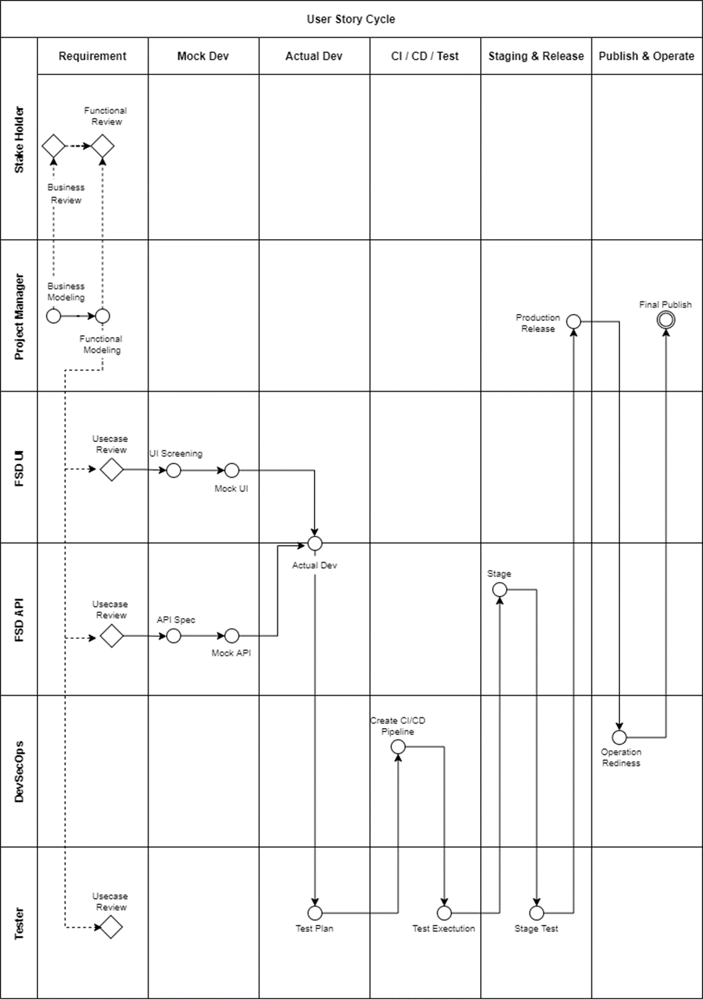
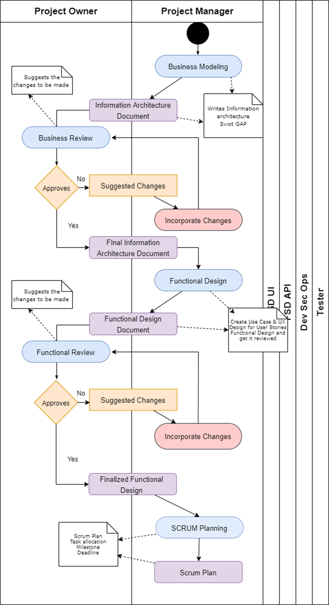
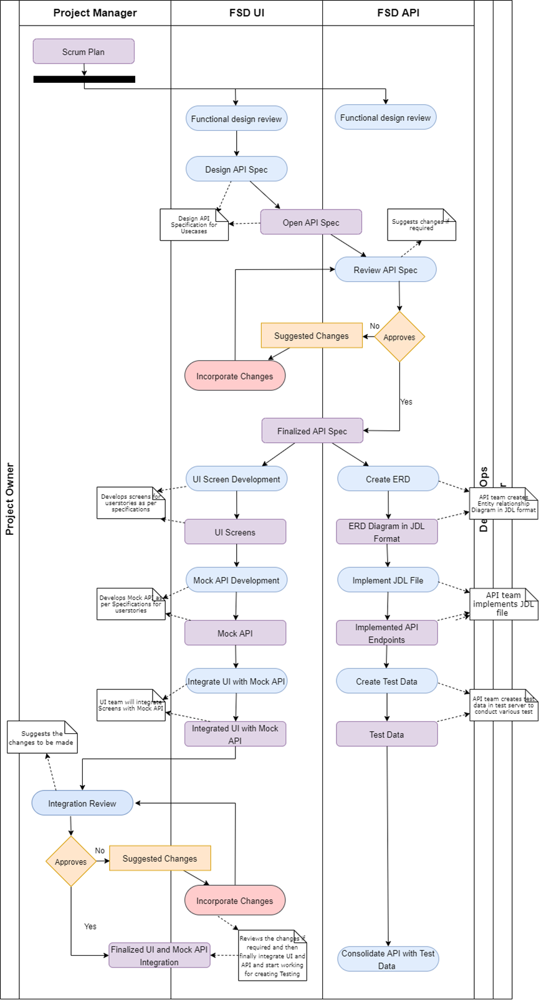
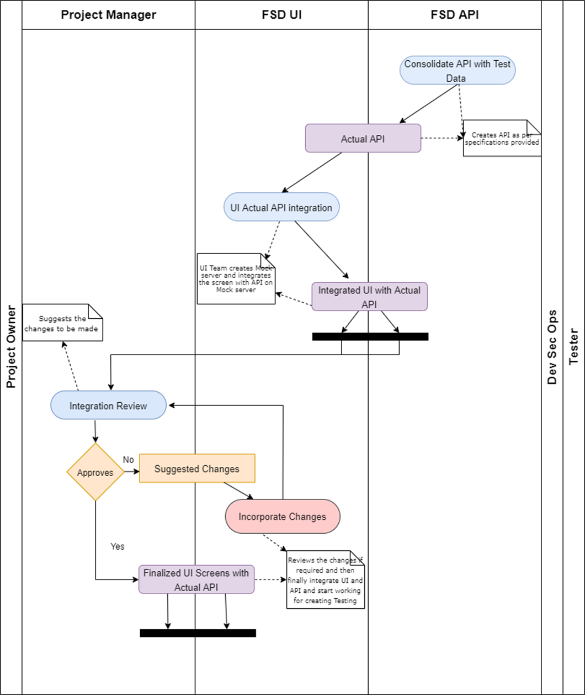
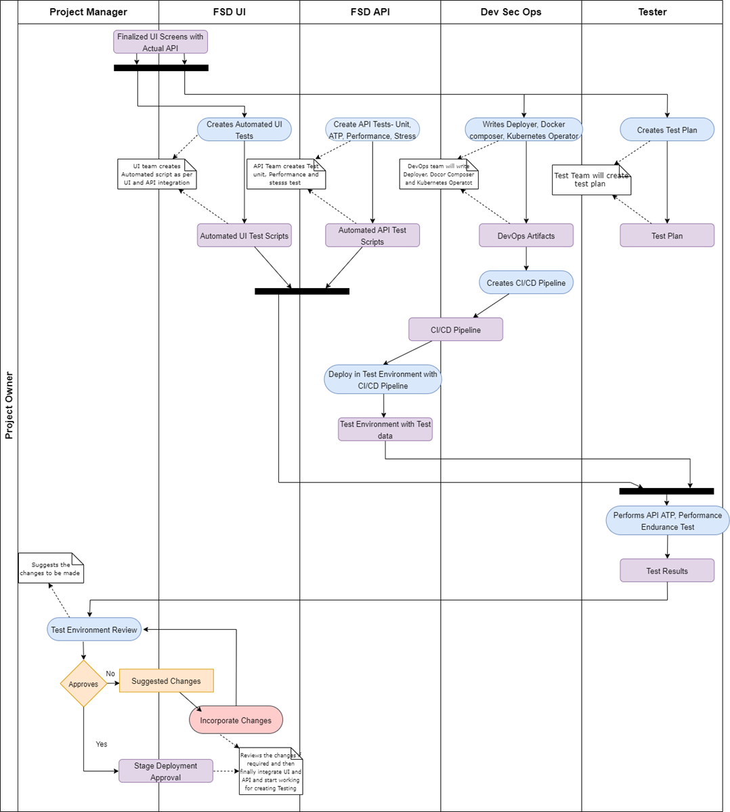
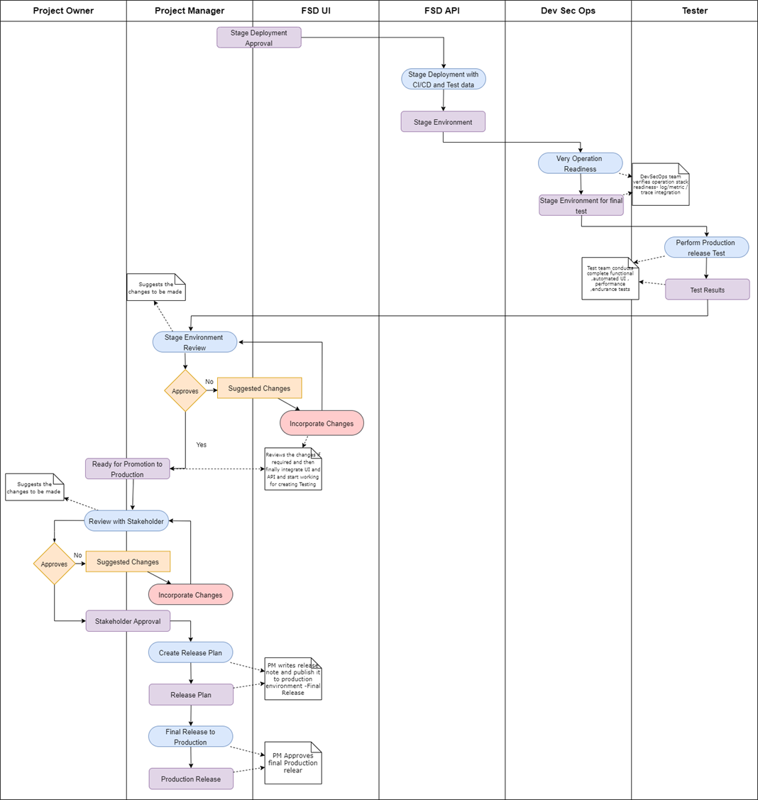

                        Our Software Development Process
At PTR Technology, for every use case that we develop,we follow a robust and efficient 
software development process designed to deliver high-quality solutions tailored to meet 
our clients' unique needs. Our approach combines industry best practices with innovative 
techniques to ensure that every usecases are reliable, scalable, and secure.Here follows 
a typical UseCase cycle.

To know the details of every stages,task, checklists, Quality gates,Artifacts , please click below

# 1. Requirement    

## Brief : 

    Requirement is the stage in which Project Manager will collect as much information from 
    Project Owner and create a business model to carry out development process. Which will be 
    periodically reviewed by project owner and once business and functional module is finalised 
    project manager will proceed with Scrum planning.                       

Tasks -

-- Create Information Architecture

-- Create Functional Design

-- Create Use Case Document

-- Create UX Design Designs

-- Do UX design review with tech team

Checklists -

-- Information Architecture and Functional Design is published in Business Docs

-- Use Case Document is published in Use Cases Matrix

-- UX  Design is published in Use Cases Matrix

-- ROI Analysys is published in Use Cases Matrix

-- Functional Design Review meeting is done with Technical Team

-- Scrum Planning with Micro Level Task Allocation is done

# 2. Mock Dev

## Brief : 

    Project manager will review the functional design with UI and API team. API team will 
    provide API specs to review.UI team will then create UI screens, create Mock API then integrate Mock API with UI Screens. API team will create data design, and create Test 
    data. Once PM reviews MocK integration API team will consolidate API with Test data 
                    

Tasks-

-- Create OpenApi Specification

-- Create Postman Tests for OpenAPi specification

-- Create UI screens 

-- Create API simulator

-- Create Test Data and integrate in simulator

-- Integrate UI with Mock API

-- Create Test Plans

Checklists --

-- Finalized API Specification is available in github

-- API spec Review meeting is done with UI /API Team

-- API specification is published

-- UI code is available in GitHub that works with Mock API

-- The code has adequate build / test instructions to run mock server and review UI

-- Test Plans is available in Git and is published in Use Cases Matrix

-- Data Design Page is published in Use Cases Matrix

# 3. Actual Development

## Brief:

    Once API is consolidated with test data, API team implement the API specs and UI 
    team will integrate UI with Actual API and PM will review this integration.

     

Tasks-

-- Create API source Code in GitHub 

-- Create Junit5 Tests in GitHub

-- Create Cucumber BDD tests in GitHub

-- Create Gatling Performance/ Load Tests in GitHub

-- Do Code Review with Tech Lead

-- Do Actual UI-API integration

-- Do Branch Merge After review

Checklists --

-- API Development followed the git flow of projects (our gitops workflow like branching/ merging  etc) to develop actual API

-- API sample data is available in GitHub

-- Adequate readme instruction is available in GitHub to run with sample data

-- API are tested against postman collection generated in mock stage

-- All unit / functional / performance tests are written and kept in GitHub

-- All functional /performance tests meet SLA's

-- All functional / Performance Tests

-- Actual API works with UI by simply changing Base URL

-- API follows 10 Points API security verification

-- API is properly instrumented for performance metrics / logs / traces

-- Perf Metrics / Logs / Trace destination is configured

# 4.CI/CD/Tests

## Brief:

    This phase involves writing the automation scripts for deplyment and update/ upgrade 
    and test it as per the test plan and get it ready for staging environment for review.

Tasks-

-- CI/CD pipeline is created with  common builders/  deployer's / testers that we have created - custom tekton building blocks. 

-- Kubernetes Operator is created for the services that goes in cluster

-- Deploy in Test ENV via CI/CD pipeline

-- Do acceptance tests in test ENV

-- Upload Test results in S3 website and link with UseCase Matrix Page

-- Upload Test ENV URL in UseCase Matrix

-- Promote to stage env after revew with business lead.

Checklists –

-- Test results are loaded in S3 website and published

-- Test ENV URL is accessible in UseCase Matrix Site

-- CI/CD pipeline is integrated with tests(Unit / functional ATP / performance )

-- CI/CD pipeline can deploy the service in test ENV with sample data

-- CI/CD pipeline has the post-deployment verification available

-- Adequate readme instruction is available in GitHub to run the CI/CD pipeline

-- Stage ENV URL is accessible from UseCase Matrix

-- Adequate readme instruction is available to run stage testing by PM

# 5. Promote To Staging

## Brief:

This stage involves moving features from test environment to stage environment and do 
production qualification tests.

Tasks-

-- Stage tests and review by PM

-- PM Promote from Stage to Prod

-- PM performs API security tests in prod

-- PM creates/updates release notes

Checklists -

-- Stage Tests results are loaded in S3 website and linked with UseCase Matrix

-- Prod ENV URL is accessible from release notes

-- Prod ENV security Tests are accessible in UseCase Matrix

-- Updated Product release is available in GitHub 

# 6. Publish && Operate

## Brief:

This stage involves the verification of operation readiness and publishing the release notes 
to customers.

Tasks-

-- Prod ENV are reviewed by DevOps team from security & operation readiness perspective

-- PM announce the release note to world

Checklist -

-- Prod ENV confirms API security guideline

-- Prod ENV rightly integrate with performance / trace / log manager

-- Final announcement email is circulated to customers with a link to release note by PM

