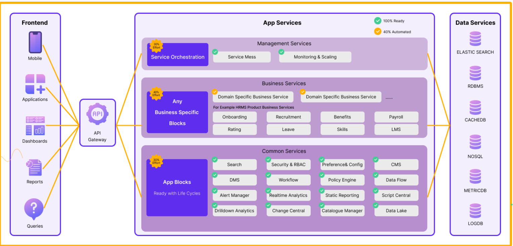
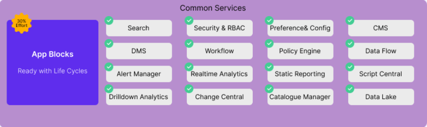
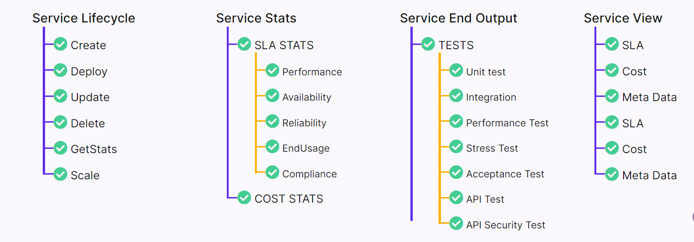
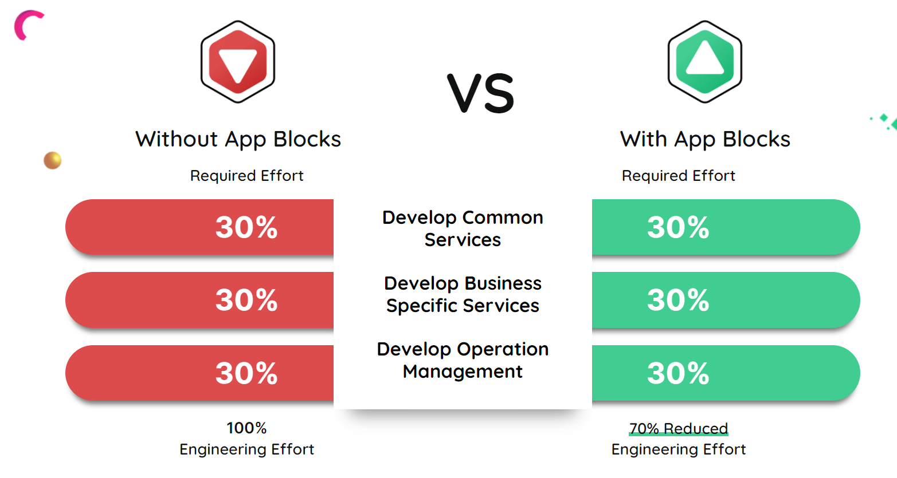
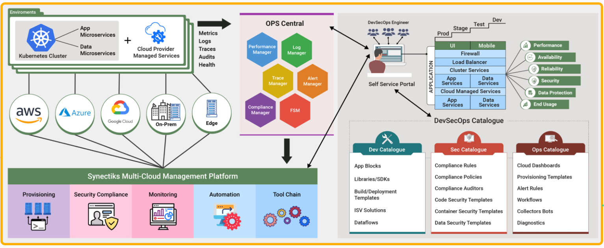

1. Single-Tenant Flexibility: Each application is uniquely yours, providing unparalleled customization and control.For every application we instantly 
provision all App and Data Services for your application.A typical application 
services as below:

2. Microservices-Based Design: We use a microservices architecture to ensure scalability, resilience, and efficient resource utilization. We accelerate Microservice development with PTR Appblocks , that cut development time and 
costs by 50%. Appblocks are common services that every enterprise product uses 
for common functionalities. 

We have readied all lifecycle for all common services
as follows.

That reduce our new Application development effort significantly as below:

3. Comprehensive Operations Management: Our platform includes a full operations management suite, streamlining maintenance and updates.

4. Cutting-Edge Technology: Built on the latest technologies, our backend platform ensures robust performance and security.

Explore few simple and some robust arcitecture that we follow to develop a simple App or a complete cloudnative enterprise product.

Learn More (architecture.md) page.