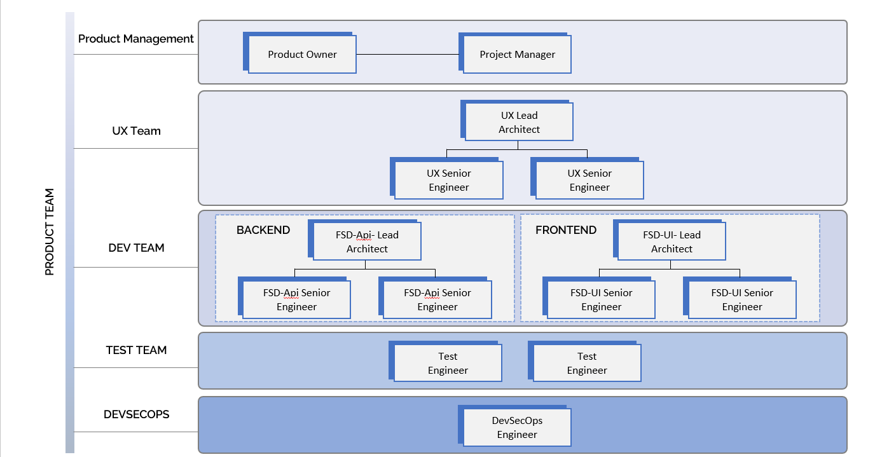
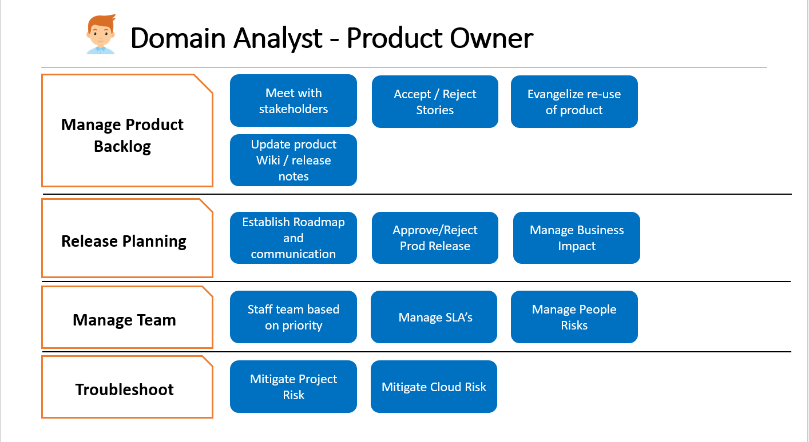
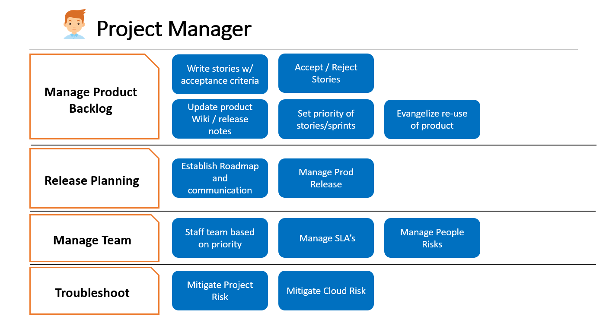
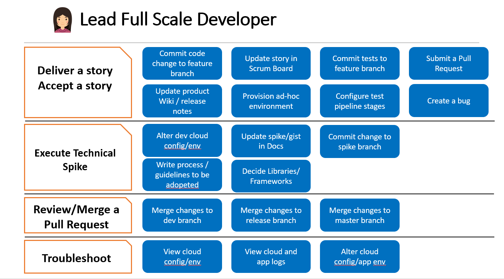
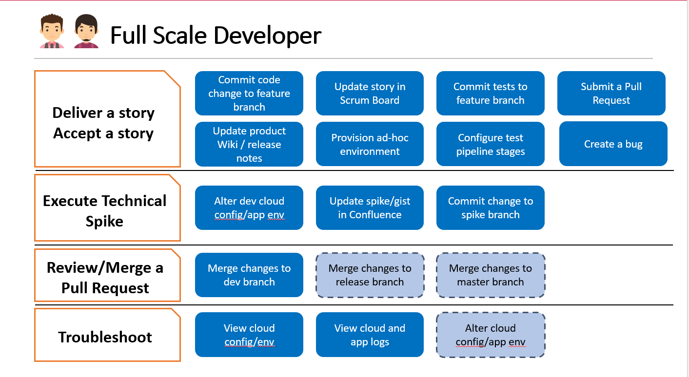
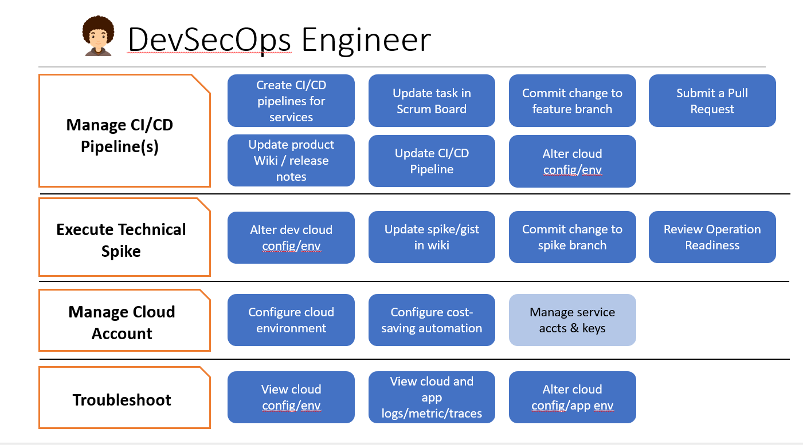

This is an example of a complete engineering team that can deliver the product use cases in predictable way. Click on each of the role to know about the role details:

# 1. Product Owner

## Product Owner Key Responsibilities

- Main interface  with the customer
- Visionary of the product
- Understand and evangelize the value and use of the product
- Gather requirements  and write stories with clear acceptance criteria
- Manage and prioritize the Product Backlog 
- Manage Business Impact
- Review and accept delivered functionality (stories)
- Organize, control, perform user testing
- User documentation, communications, training
- Release planning
- Manage licensing, budget, acquisition process

# 2. Project Manager

## Project Manager Key Responsibilities
- Facilitator
- Coach
- Framework custodian
- Remove impediments
- Radiate information – ensure that team’s progress and successes are highly visible to all stakeholders, including the team itself
- Support the Product Owner with communicating updates, impediments, backlog and release planning maintenance
- Facilitate creativity and empowerment for the development team
- Improve team’s engineering practices and processes as needed
- Communicate with clear and frequent communication among all stakeholders

# 3. Lead Full Scale Developer

## Lead Full Scale Developer Key Responsibilities

- Leads team in alignment on design and architecture
- Accountable for team’s code quality and delivery
- Leads team in alignment on a unified vision and technical direction
- Ensure architectural integrity is maintained
- Sets the standard (coding and otherwise). Mentor other technical staff.
- Co-ordinate team’s day-to-day technical activities. 
- For Production, partners with Product Owner to ensure appropriate approvals are obtained and logged
- Collaborate with enterprise architects to understand technology solution roadmap, and technical requirements with focus on IT automation outcomes
- Leads team in alignment on a unified vision and technical direction
- Accountable for team’s code quality and delivery
- Sets the standard (coding and otherwise)
- Ensure adherence to best practices and standards (source code control, etc). Mentor other technical staff.
- Co-ordinate team’s day-to-day technical activities. 
- Troubleshoot – has keys to all environments
- Document process in wiki for developers to get started in local environment

# 4. Full Scale Developer 

## Full Scale Developer Key Responsibilities

- Accountable for their code and delivery
- Responsible for analysis, estimating, design, coding, testing
- Develop to achieve sprint goals and deliver quality stories
- Identify obstacles and inform Scrum Master
- Self-organize
- Commit test code to a feature branch and manage repository of tests
- Submit pull request to merge tests into dev branch and pipeline
- Regression testing required to ensure new story implementation does not break previous stories delivered
- Update product wiki/release notes
- Provision ad-hoc environment for performance testing
- Establish a configuration-based method to introduce test into pipeline without altering pipeline
- Share in the troubleshooting when stuff breaks

# DevSecOps Engineer

## DevSecOps Engineer Key Responsibilities
- Manage CI/CD pipeline – owns the pipeline soup to nuts
- Configure environments
- Commit changes to feature branches for those infrastructure/code artefacts in the pipeline
- Spike as needed
- Troubleshoot – has keys to all non-prod environments
- Manage Cloud Account
- Help get team members on and off the dev cycle (buffer work)
- Generally doing the right things to reduce spend, largely through automation scripts like moving files to glacier after time,.. Trimming log streams or snapshots etc..
- Implement broader  cloud governance.
- Design, develop and deploy processes to enable end-to-end automation of cloud infrastructure to support software development teams
- Contribute towards the long-term vision for IaaS/PaaS solution options in the Cloud (Azure)
- Provision needed resource and install appropriate software packages –both on premise in our datacenter and on Cloud
- Manage and deploy periodic milestone & patch releases of software package as needed
- Implement monitoring and metrics reporting for Cloud utilization
- Document and manage in supporting application interactions with 3rd party sub-systems
- Provide support, help test and debug the software, and ensure automated environment provisioning is operating successfully

